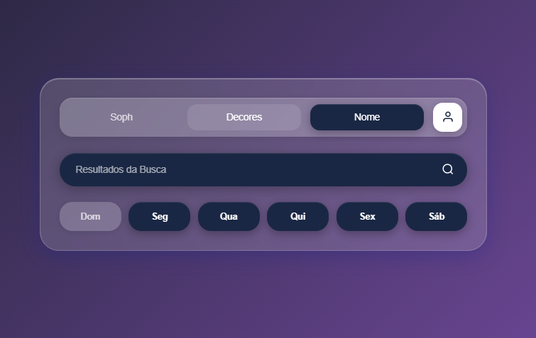

# Agenda Semanal Moderna

<div align="center">


**Interface moderna de agenda semanal com design neomorphism/glassmorphism e fundo estilo grafiti urbano 📅**

Aplicação web com navegação por abas, seleção de dias e busca integrada

</div>

---

## Sobre o Projeto

**Agenda Semanal Moderna** é uma aplicação web que apresenta uma interface elegante e moderna para organização semanal. O projeto combina efeitos visuais de glassmorphism e neomorphism com um fundo estilo grafiti urbano, criando uma experiência visual única e envolvente.

### Características Principais

- Interface de usuário moderna e intuitiva
- Sistema de navegação por abas (Soph, Decores, Nome)
- Seleção interativa de dias da semana
- Barra de busca integrada com feedback visual
- Design glassmorphism com efeito de vidro fosco
- Fundo animado estilo grafiti urbano
- Totalmente responsivo para mobile, tablet e desktop
- Zero dependências - apenas HTML, CSS e JavaScript vanilla
- Performance otimizada sem bibliotecas externas

---

## Tecnologias Utilizadas

- **[HTML5](https://developer.mozilla.org/pt-BR/docs/Web/HTML)** - Estrutura semântica da aplicação
- **[CSS3](https://developer.mozilla.org/pt-BR/docs/Web/CSS)** - Estilização com animações e efeitos modernos
- **[JavaScript ES6+](https://developer.mozilla.org/pt-BR/docs/Web/JavaScript)** - Interatividade e manipulação do DOM

---

## Preview

<div align="center">



</div>

---

## Funcionalidades

### Navegação por Abas
- Sistema de tabs com três seções: Soph, Decores e Nome
- Transições suaves entre abas
- Indicação visual da aba ativa
- Ícone de perfil do usuário integrado

### Seleção de Dias da Semana
- Toggle interativo para marcar/desmarcar dias
- Estados visuais para dias selecionados e não selecionados
- Feedback visual imediato ao clicar
- Suporte para Domingo, Segunda, Quarta, Quinta, Sexta e Sábado

### Busca Integrada
- Barra de pesquisa com design neomorphism
- Busca ativada por clique ou tecla Enter
- Ícone de lupa interativo
- Feedback visual ao interagir

### Design e Animações
- Efeito glassmorphism com blur e transparência
- Fundo grafiti com padrões geométricos
- Animações de pulse e brilho
- Cores vibrantes estilo street art
- Micro-interações em todos os elementos clicáveis

---

## Como Rodar o Projeto

### Pré-requisitos

- Navegador web moderno (Chrome, Firefox, Safari, Edge)
- Editor de código (VS Code recomendado)
- Git instalado

### Instalação

1. **Clone o repositório**

```bash
git clone https://github.com/erikalaiane/agenda-semanal-moderna.git

2. **Entre no diretório do projeto**

```bash
cd agenda-semanal-moderna
```

3. **Abra o arquivo no navegador**

Você pode simplesmente abrir o arquivo `index.html` diretamente no navegador, ou usar um servidor local:

**Com Python:**
```bash
python -m http.server 8000
```

**Com Node.js:**
```bash
npx http-server
```

**Com PHP:**
```bash
php -S localhost:8000
```

4. **Acesse no navegador**

```
http://localhost:8000
```

---

## Estrutura do Projeto

```
agenda-semanal-moderna/
├── index.html          # Estrutura HTML principal
├── style.css           # Estilos e animações
├── script.js           # Lógica e interatividade
├── images/             # Imagens do projeto
│   └── site.png        # Preview da aplicação
└── README.md           # Documentação
```

---

## Responsividade

O projeto é totalmente responsivo e testado em:

- **Mobile** (< 600px)
- **Tablet** (600px - 1023px)
- **Desktop** (1024px - 1439px)
- **Large Desktop** (1440px+)

---

## Contribuindo

Contribuições são sempre bem-vindas! Para contribuir:

1. Faça um fork do projeto
2. Crie uma branch para sua feature (`git checkout -b feature/MinhaFeature`)
3. Commit suas mudanças (`git commit -m 'Adiciona nova feature'`)
4. Push para a branch (`git push origin feature/MinhaFeature`)
5. Abra um Pull Request

---

## Melhorias Futuras

- [ ] Integração com localStorage para salvar preferências
- [ ] Sistema de temas (claro/escuro)
- [ ] Adicionar mais opções de idiomas
- [ ] Implementar sistema de notificações
- [ ] Criar modo de visualização em calendário
- [ ] Adicionar suporte para eventos e lembretes
- [ ] Exportar agenda para PDF
- [ ] Sincronização com Google Calendar

---

## Autor(a)

**Érika Laiane**

[](https://github.com/erikalaiane)
[](https://www.linkedin.com/in/erika-laiane-azevedo)
[](mailto:erikalaianeazevedosantos@gmail.com)

---

<div align="center">

Desenvolvido com 💜 por Érika Laiane

</div>
